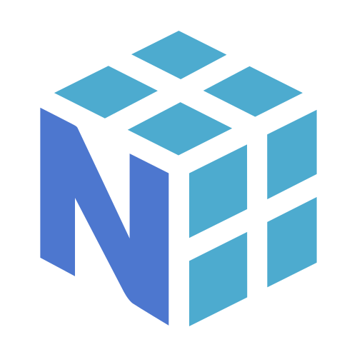

### Hi there 👋
I’m Mohammed Hamdy. I’m currently self-studying machine learning and computer science. I’m interested in the application of machine learning and natural language processing in biology and in neural network compression techniques.

I enjoy learning, discussing, and comparing different programming languages and deep learning frameworks. I think that there’s always something new to learn from every new tool. 

## 🔮 Technologies
#### Programming Languages
Python, R, JavaScript, TypeScript, Rust

 
&nbsp&nbsp&nbsp&nbsp&nbsp

&nbsp&nbsp&nbsp&nbsp&nbsp

&nbsp&nbsp&nbsp&nbsp&nbsp

&nbsp&nbsp&nbsp&nbsp&nbsp

#### Machine Learning
Numpy, JAX, TensorFlow, PyTorch, Scikit-Learn

 
&nbsp&nbsp&nbsp&nbsp&nbsp

&nbsp&nbsp&nbsp&nbsp&nbsp

&nbsp&nbsp&nbsp&nbsp&nbsp

&nbsp&nbsp&nbsp&nbsp&nbsp

#### Natural Language Processing
Hugging Face Ecosystem, spaCy

 
&nbsp&nbsp&nbsp&nbsp&nbsp

#### Web Development
ReactJS, NextJS

&nbsp&nbsp&nbsp&nbsp&nbsp

## 🏆 My Github Stats

<!--
**mmhamdy/mmhamdy** is a ✨ _special_ ✨ repository because its `README.md` (this file) appears on your GitHub profile.

Here are some ideas to get you started:

- 🔭 I’m currently working on ...
- 🌱 I’m currently learning ...
- 👯 I’m looking to collaborate on ...
- 🤔 I’m looking for help with ...
- 💬 Ask me about ...
- 📫 How to reach me: ...
- 😄 Pronouns: ...
- ⚡ Fun fact: ...

-->
